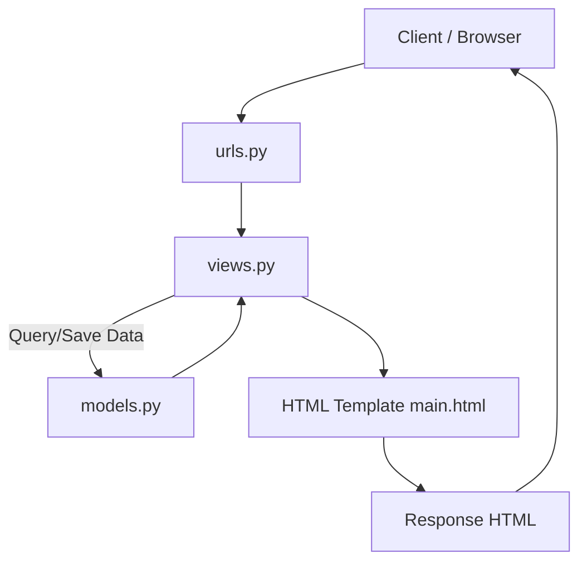
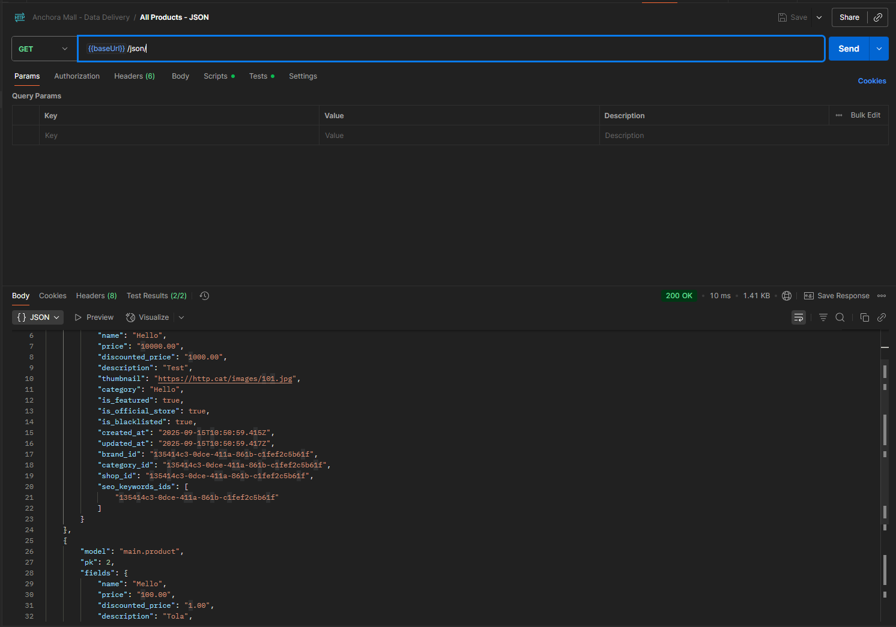
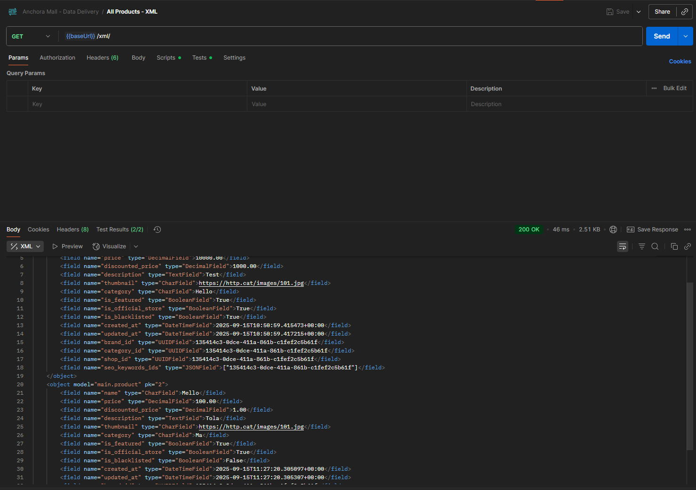
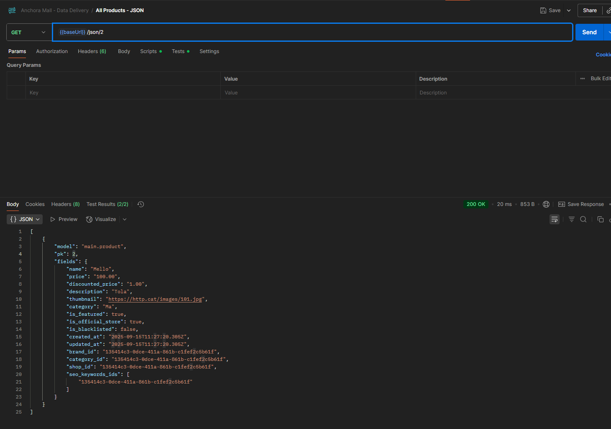
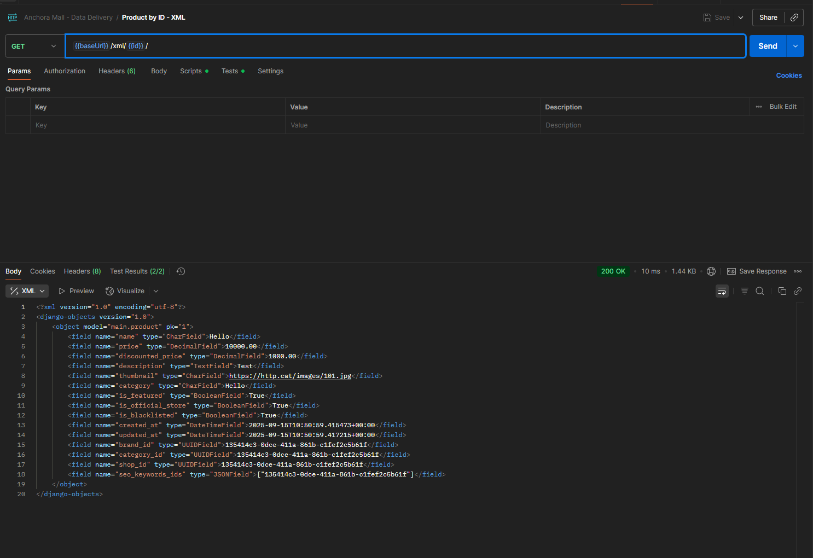

# Anchora Mall

One-stop solution for your needs!

# Steps of Work - Tugas Individu I
1. Persiapan environment dan inisialisasi project
```bash
vincent@DESKTOP-JN0AUB6:~/pbp/individual-assignment/anchora-mall$ python3 -m venv .venv
vincent@DESKTOP-JN0AUB6:~/pbp/individual-assignment/anchora-mall$ source .venv/bin/activate
(.venv) vincent@DESKTOP-JN0AUB6:~/pbp/individual-assignment/anchora-mall$ nano requirements.txt
(.venv) vincent@DESKTOP-JN0AUB6:~/pbp/individual-assignment/anchora-mall$ pip install -r requirements.txt
```
Virtual environment dibuat agar dependency proyek isolated sistem global. Aktivasi environment memastikan semua package (seperti Django) terinstall di .venv/. Selain itu, dilakukan instalasi deps yang digunakan melalui file requirements.txt dan pip.

2. Membuat project dan django app, serta menyesuaikan settings dan env vars
```bash
(.venv) vincent@DESKTOP-JN0AUB6:~/pbp/individual-assignment/anchora-mall$ django-admin startproject anchora
(.venv) vincent@DESKTOP-JN0AUB6:~/pbp/individual-assignment/anchora-mall$ cd anchora
(.venv) vincent@DESKTOP-JN0AUB6:~/pbp/individual-assignment/anchora-mall/anchora$ python3 manage.py startapp main
```
Kemudian lakukan routing pada anchora/urls.py:
```python
urlpatterns = [
    path("admin/", admin.site.urls),
    path('', include('main.urls')),
]
```
Lalu buat routing di main/urls.py:
```python
urlpatterns = [
    path('', show_main, name='show_main'),
]
```
Buat fungsi views pada main/views.py:
```python
from django.shortcuts import render
from django.http import HttpResponse
from django.http import HttpRequest as Request

# Create your views here.
def show_main(request: Request) -> HttpResponse:
    return render(request, 'main.html')
```
Modifikasi settings agar sesuai dengan lingkungan serta aturan deployment di pws:
```python
"""
Django settings for anchora project.

Generated by 'django-admin startproject' using Django 5.2.6.

For more information on this file, see
https://docs.djangoproject.com/en/5.2/topics/settings/

For the full list of settings and their values, see
https://docs.djangoproject.com/en/5.2/ref/settings/
"""

from pathlib import Path
import os
from dotenv import load_dotenv

# Load environment variables from .env file
load_dotenv()

# Build paths inside the project like this: BASE_DIR / 'subdir'.
BASE_DIR = Path(__file__).resolve().parent.parent


# Quick-start development settings - unsuitable for production
# See https://docs.djangoproject.com/en/5.2/howto/deployment/checklist/

# SECURITY WARNING: keep the secret key used in production secret!
SECRET_KEY = "django-insecure-lxz9q3m*y_1mi&495&&fvrmz8%5%a$p#06&3#nrm+#^uvb46^3"

# SECURITY WARNING: don't run with debug turned on in production!
PRODUCTION = os.getenv('PRODUCTION', 'False').lower() == 'true'
DEBUG = True

ALLOWED_HOSTS = ["vincentius-filbert-anchora.pbp.cs.ui.ac.id"]


# Application definition

INSTALLED_APPS = [
    "django.contrib.admin",
    "django.contrib.auth",
    "django.contrib.contenttypes",
    "django.contrib.sessions",
    "django.contrib.messages",
    "django.contrib.staticfiles",
    "main",
]

MIDDLEWARE = [
    "django.middleware.security.SecurityMiddleware",
    "django.contrib.sessions.middleware.SessionMiddleware",
    "django.middleware.common.CommonMiddleware",
    "django.middleware.csrf.CsrfViewMiddleware",
    "django.contrib.auth.middleware.AuthenticationMiddleware",
    "django.contrib.messages.middleware.MessageMiddleware",
    "django.middleware.clickjacking.XFrameOptionsMiddleware",
]

ROOT_URLCONF = "anchora.urls"

TEMPLATES = [
    {
        "BACKEND": "django.template.backends.django.DjangoTemplates",
        "DIRS": [],
        "APP_DIRS": True,
        "OPTIONS": {
            "context_processors": [
                "django.template.context_processors.request",
                "django.contrib.auth.context_processors.auth",
                "django.contrib.messages.context_processors.messages",
            ],
        },
    },
]

WSGI_APPLICATION = "anchora.wsgi.application"


# Database
# https://docs.djangoproject.com/en/5.2/ref/settings/#databases

# Database configuration
if PRODUCTION:
    # Production: gunakan PostgreSQL dengan kredensial dari environment variables
    DATABASES = {
        'default': {
            'ENGINE': 'django.db.backends.postgresql',
            'NAME': os.getenv('DB_NAME'),
            'USER': os.getenv('DB_USER'),
            'PASSWORD': os.getenv('DB_PASSWORD'),
            'HOST': os.getenv('DB_HOST'),
            'PORT': os.getenv('DB_PORT'),
            'OPTIONS': {
                'options': f"-c search_path={os.getenv('SCHEMA', 'public')}"
            }
        }
    }
else:
    # Development: gunakan SQLite
    DATABASES = {
        'default': {
            'ENGINE': 'django.db.backends.sqlite3',
            'NAME': BASE_DIR / 'db.sqlite3',
        }
    }


# Password validation
# https://docs.djangoproject.com/en/5.2/ref/settings/#auth-password-validators

AUTH_PASSWORD_VALIDATORS = [
    {
        "NAME": "django.contrib.auth.password_validation.UserAttributeSimilarityValidator",
    },
    {
        "NAME": "django.contrib.auth.password_validation.MinimumLengthValidator",
    },
    {
        "NAME": "django.contrib.auth.password_validation.CommonPasswordValidator",
    },
    {
        "NAME": "django.contrib.auth.password_validation.NumericPasswordValidator",
    },
]


# Internationalization
# https://docs.djangoproject.com/en/5.2/topics/i18n/

LANGUAGE_CODE = "en-us"

TIME_ZONE = "UTC"

USE_I18N = True

USE_TZ = True


# Static files (CSS, JavaScript, Images)
# https://docs.djangoproject.com/en/5.2/howto/static-files/

STATIC_URL = "static/"

# Default primary key field type
# https://docs.djangoproject.com/en/5.2/ref/settings/#default-auto-field

DEFAULT_AUTO_FIELD = "django.db.models.BigAutoField"
```
3. Membuat model Product
```python
from django.db import models

class Product(models.Model):
    name = models.CharField(max_length=255)
    price = models.DecimalField(max_digits=10, decimal_places=2)
    discounted_price = models.DecimalField(max_digits=10, decimal_places=2, null=True, blank=True)
    description = models.TextField()
    thumbnail = models.URLField()
    category = models.CharField(max_length=100)
    is_featured = models.BooleanField(default=False)
    is_official_store = models.BooleanField(default=False)
    is_blacklisted = models.BooleanField(default=False)
    created_at = models.DateTimeField(auto_now_add=True)
    updated_at = models.DateTimeField(auto_now=True)

    # for foreign keys preparation
    brand_id = models.UUIDField()
    category_id = models.UUIDField()
    shop_id = models.UUIDField()
    seo_keywords_ids = models.JSONField(default=list)

    def __str__(self):
        return self.name
```
Lalu setting envvars pada `.env.prod` dan `.env`
```env
DB_NAME=vinxxx
DB_HOST=152.xxx
DB_PORT=xxxx
DB_USER=vinxxx
DB_PASSWORD=xxx
SCHEMA=tugas_individu
PRODUCTION=true
```
```env
PRODUCTION=false
```

4. Migrasi database
```bash
(.venv) vincent@DESKTOP-JN0AUB6:~/pbp/individual-assignment/anchora-mall/anchora$ python manage.py makemigrations main
Migrations for 'main':
  main/migrations/0001_initial.py
    + Create model Product
```
Lalu jalankan migrasi:
```bash
(.venv) vincent@DESKTOP-JN0AUB6:~/pbp/individual-assignment/anchora-mall/anchora$ python manage.py migrate
Operations to perform:
  Apply all migrations: admin, auth, contenttypes, main, sessions
Running migrations:
  Applying contenttypes.0001_initial... OK
  Applying auth.0001_initial... OK
  Applying admin.0001_initial... OK
  Applying admin.0002_logentry_remove_auto_add... OK
  Applying admin.0003_logentry_add_action_flag_choices... OK
  Applying contenttypes.0002_remove_content_type_name... OK
  Applying auth.0002_alter_permission_name_max_length... OK
  Applying auth.0003_alter_user_email_max_length... OK
  Applying auth.0004_alter_user_username_opts... OK
  Applying auth.0005_alter_user_last_login_null... OK
  Applying auth.0006_require_contenttypes_0002... OK
  Applying auth.0007_alter_validators_add_error_messages... OK
  Applying auth.0008_alter_user_username_max_length... OK
  Applying auth.0009_alter_user_last_name_max_length... OK
  Applying auth.0010_alter_group_name_max_length... OK
  Applying auth.0011_update_proxy_permissions... OK
  Applying auth.0012_alter_user_first_name_max_length... OK
  Applying main.0001_initial... OK
  Applying sessions.0001_initial... OK
```

5. Membuat template HTML
```html
<!DOCTYPE html>
<html lang="en">
<head>
    <meta charset="UTF-8">
    <meta name="viewport" content="width=device-width, initial-scale=1.0">
    <title>Anchora Mall</title>
</head>
<body>
    <h1>Welcome to Anchora Mall</h1>
    <p>Your one-stop shop for everything!</p>
    <p>Vincentius Filbert Amadeo</p>
    <p>2406351711 - PBP E</p>
</body>
</html>
```

6. Tangkapan layar hasil proses

![Screenshot](https://lh3.googleusercontent.com/rd-d/ALs6j_Fo9IBNKGSYGRkLEa6ooPoXho9JlplI6EwS1xM0qnTvv4nhPYkchU9X0xgRVmAsZluUAjyOE8EWXqe3cSP9myYvGbJnAs7tmVO8Lq7C_h-q5tZWCx-YZpTchny5y_SBtIzSIgtie-cLeRjK-WqOmYJE0Opk23EPE92yQmV2sl66gAFSArp2DoDQalRgCZ-7fDxMOvk6FOuAmLOVHM2R8Fe2zQ1EFGF9BUJi7tyDKS7HvxvZT38XyN9emRVAm_qmAZmIaIVSxndPAOqXyw8JluJVR54oGNZsRGv9JlhL6sfo50gB_3CpZI-wjaxgBuqlPrLX37DKSJkZGdTdb4IlKWG7dO0vZITItuwVO6V44KRislxvbAoQS7SCQ5ShLLtriyJVPgQKVEJlUfRd1AojgZIlqk1_YB3E4uv-XzA9Z_zZ0r8GKAqtSTq5rMQ8Bb3krZ-GbbiU5RjgtRj2Zs15VDwrQbZuRXSJS89X1w1PuMwrI59avrA15rGVFlL9N3s3vnv6yrWG31gGUZrjq1c5pMmok5kDMLqEpYs1wFezv50PJTufmW2NEatM0A2bkMcVL3VilDe9MmX6CSCEFAbvn0iD0gDtNeSwpx5D6Xq7ZbYB8btQ_fXbSi-JDXSItF0Vux3ydId8RHAS-awAUxjskV4qOAMbtpcJjBRlHYvEokB_K5iOr_wW9PD1b5YhQpF0lYI1uhbdTLIUkmNn6-0pfPsMxiKVPIi8w5yhvOD4vD9WIWD1nHzy3WV4Iayls8yPcCbe8iWoeeBlA1BmkCi6MEMw8vYs6W_PeXfQiBL5JermOwhsw0AyUp80hFBqIhoNDOYif94-9S21_yYk3RY6RRc_gF-jvyDpeAE56QxSQDIdiZ5ieX3LgSVah7hEaa4t3CtpoWpi5qZCNR0-5GuiHG8UHQsMPO7UxtjncfkZNEkpQ2bhR-Hy86-QPgxcfBbfzdGGl5AnLLj3qy48H6jnQhtCEveG3p-g-Caf8yf1KI6rvitbKCc702YxkXaQO0OJHi1q9okicbuX_8SYP8i-ME8=s1360)

# Tautan
https://vincentius-filbert-anchora.pbp.cs.ui.ac.id/

# Client Request Flow in Django

Berikut bagan alur request dari client sampai menghasilkan response pada aplikasi Django:



### Penjelasan:
- **urls.py**: menentukan rute request, misalnya path `/` diarahkan ke fungsi `show_main` di `views.py`.  
- **views.py**: berisi fungsi yang memproses request; dapat mengakses `models.py` untuk mengambil/menyimpan data, lalu merender template.  
- **models.py**: berisi class Python yang mewakili tabel database; digunakan views untuk berinteraksi dengan data. Django secara otomatis membuat migration dengan ORM bawaannya.
- **HTML Template (main.html)**: berisi tampilan akhir yang akan diberikan sebagai response ke client, dengan placeholder yang akan dirender oleh views dan mengisi value mapping.  

# Peran `settings.py` dalam proyek Django
Berkas `settings.py` adalah konfigurasi dari sebuah proyek Django. Semua pengaturan penting didefinisikan di sini, seperti:
- **Database**: jenis database yang dipakai (SQLite, PostgreSQL, dll.), credential, dan lokasi.
- **INSTALLED_APPS**: daftar aplikasi Django (built-in maupun buatan kita) yang aktif dalam proyek.
- **Middleware**: komponen yang memproses request/response sebelum sampai ke views atau setelah keluar dari views.
- **Static & Media Files**: konfigurasi lokasi file statis (CSS, JS, gambar) dan file media (upload user).
- **Security**: pengaturan `SECRET_KEY`, `DEBUG`, dan `ALLOWED_HOSTS`.

# Cara kerja migrasi database di Django
Mekanisme migrasi di Django terdiri dari dua langkah:
1. **`makemigrations`** → Ketika kita membuat atau mengubah sebuah model di models.py, Django tidak langsung mengubah struktur database. Django terlebih dahulu membandingkan definisi model terbaru dengan kondisi terakhir yang sudah terekam (riwayat migrasi di tabel khusus (`django_migrations`)). Perubahan yang terdeteksi kemudian diterjemahkan ke dalam sebuah file migrasi saat kita menjalankan perintah makemigrations.
2. **`migrate`** → Di tahap ini, Django membaca semua file migrasi yang belum dijalankan (dicatat dalam tabel khusus bernama django_migrations di database). Kemudian Django menerjemahkan instruksi Python dalam file migrasi menjadi perintah SQL yang sesuai dengan jenis database yang digunakan (misalnya SQLite, PostgreSQL, atau MySQL). 

Dengan ini, Django juga dapat disebut memiliki ORM bawaan.

# Mengapa framework Django dijadikan permulaan pembelajaran pengembangan perangkat lunak?
Django dijadikan permulaan pembelajaran pengembangan perangkat lunak karena sifatnya yang lengkap, terstruktur, dan ramah pemula. Framework ini menganut prinsip "batteries included", artinya Django menyediakan banyak fitur bawaan yang siap dipakai, mulai dari ORM (Object-Relational Mapping), sistem autentikasi pengguna, hingga admin panel untuk mengelola data tanpa perlu menulis kode tambahan.

Alasan lain adalah karena di Fasilkom, mahasiswa sebelumnya sudah mengenal Python melalui mata kuliah DDP 1. Hal ini membuat transisi ke Django menjadi lebih mudah, karena Django sendiri ditulis menggunakan Python. Dengan begitu, mahasiswa tidak perlu mempelajari bahasa pemrograman baru sekaligus framework baru—cukup fokus pada konsep pengembangan perangkat lunak berbasis web.

Sebagai seorang developer, saya juga merasakan bahwa Django sangat cocok dijadikan framework pertama. Django membantu memahami alur pengembangan perangkat lunak dari ujung ke ujung: bagaimana request diproses oleh urls.py, ditangani oleh views.py, data dikelola oleh models.py, dan hasil akhirnya ditampilkan ke pengguna melalui template HTML. Ditambah lagi, ORM bawaan Django memudahkan pengelolaan database tanpa harus menulis SQL secara manual.

Dengan fitur-fitur tersebut, Django memberi gambaran yang jelas tentang praktik terbaik dalam membangun aplikasi perangkat lunak modern, dan struktur Django yang fixed juga membantu mahasiswa untuk on-track dalam organisasi sistem.

# Apakah ada feedback untuk asisten dosen tutorial 1 yang telah kamu kerjakan sebelumnya?
Sudah cukup baik.

---

## Data Delivery (Tugas Individu II)

### Mengapa kita memerlukan data delivery dalam pengimplementasian sebuah platform?
Integrasi melalui API memungkinkan berbagai jenis client—seperti web, aplikasi mobile, maupun layanan pihak ketiga—untuk mengakses data yang sama secara konsisten. Dengan pendekatan ini, terjadi pemisahan concern yang jelas: frontend dan backend dapat dikembangkan serta di-scale secara mandiri sesuai kebutuhan tanpa saling menghambat. Selain itu, penggunaan format standar seperti JSON atau XML mendukung interoperabilitas, sehingga sistem yang berbeda tetap bisa saling berkomunikasi dengan mudah. Dari sisi efisiensi distribusi, data hanya perlu disediakan dari satu sumber, namun dapat dikonsumsi berkali-kali oleh berbagai client tanpa perlu memuat ulang atau merender ulang HTML di server.

### XML vs JSON — mana yang lebih baik? Mengapa JSON lebih populer?
XML unggul dalam konteks yang membutuhkan skema atau validasi ketat menggunakan XSD, dukungan namespace untuk menghindari konflik penamaan, serta representasi dokumen yang lebih berorientasi pada markup. Sebaliknya, JSON lebih kuat ketika dibutuhkan format yang ringkas, dengan tipe data yang lebih alami bagi bahasa pemrograman modern seperti object dan array, parsing yang cepat, serta ukuran payload yang kecil. Popularitas JSON sendiri didorong oleh ekosistem web dan mobile yang sangat erat kaitannya dengan JavaScript, pengalaman pengembang (developer experience) yang lebih sederhana, serta efisiensi dari sisi bandwidth dan latensi yang lebih rendah dibanding XML.

### Fungsi `is_valid()` pada Django Form dan mengapa dibutuhkan
- Validasi: menjalankan validator field dan `clean()`/`clean_<field>()` untuk memastikan data sesuai aturan.
- Normalisasi: mengubah data mentah ke tipe Python yang benar dan mengisi `form.cleaned_data` saat valid.
- Error handling: mengisi `form.errors` saat invalid sehingga bisa ditampilkan ke pengguna.
- Keamanan: mencegah data tidak valid/berbahaya tersimpan ke database.

### Mengapa membutuhkan `csrf_token` pada form Django? Apa risikonya jika tidak ada?
csrf_token pada form Django berfungsi sebagai mekanisme perlindungan terhadap serangan Cross-Site Request Forgery (CSRF). Token ini unik untuk setiap sesi pengguna dan akan diverifikasi server setiap kali ada permintaan POST. Dengan adanya token, server dapat memastikan bahwa request memang berasal dari aplikasi yang sah, bukan dari sumber luar yang berusaha memanipulasi pengguna.

Jika csrf_token tidak digunakan, risiko yang muncul adalah penyerang dapat memanfaatkan sesi login korban untuk mengeksekusi aksi tanpa sepengetahuannya. Misalnya, penyerang membuat sebuah halaman berbahaya yang berisi form tersembunyi dan otomatis melakukan submit ke aplikasi Anda. Ketika korban membuka halaman tersebut dalam keadaan sudah login, aksi seperti perubahan password, transfer data sensitif, atau manipulasi akun dapat terjadi dengan kredensial korban, tanpa ia sadari.

### Implementasi checklist langkah demi langkah (apa yang saya lakukan)
1. Model: menggunakan `Product` yang sudah ada di `main/models.py`.
2. Data delivery views: menambah di `main/views.py`:
     - `show_products_xml`, `show_products_json` (list semua produk)
     - `show_product_by_id_xml`, `show_product_by_id_json` (filter by `pk`)
     - Serialisasi menggunakan `django.core.serializers`.
3. Routing: menambah path di `main/urls.py` untuk endpoint `json/`, `xml/`, `json/<id>/`, `xml/<id>/`.
4. Form: membuat `main/forms.py` dengan `ProductForm` (ModelForm) dan view `add_product` yang memanggil `form.is_valid()` lalu `form.save()`.
5. Halaman list dan detail:
     - `product_list` menampilkan tabel produk + tombol "Add" dan "Detail".
     - `product_detail` menampilkan informasi lengkap produk.
     - Template: `main/templates/product_list.html`, `add_product.html`, `product_detail.html` (form menyertakan ``).
6. Koleksi Postman: menambahkan file `postman/anchora.postman_collection.json` berisi 4 request untuk menguji endpoint data delivery.

### Feedback untuk asdos pada tutorial 2
- Materi sudah jelas dan runtut, contoh kode tepat sasaran. Bisa ditambahkan tips debugging umum (mis. `urls.py` vs `path` yang tidak nyambung, error CSRF, dan cara melihat `form.errors`) agar pemula lebih cepat menemukan akar masalah.

### Menguji endpoint dengan Postman
- Import Postman collection: buka Postman → Import → pilih `postman/anchora.postman_collection.json`.
- Jalankan server:
    ```bash
    python3 manage.py runserver
    ```
- Sesuaikan variable `baseUrl` jika perlu. Ubah variable `id` ke ID produk yang ada.
- 4 screenshot hasil request berikut tersimpan ke folder `postman/screenshots/`:
    - `all-products-json.png` untuk `GET /json/`
    - `all-products-xml.png` untuk `GET /xml/`
    - `product-by-id-json.png` untuk `GET /json/<id>/`
    - `product-by-id-xml.png` untuk `GET /xml/<id>/`






---

## Authentication & Authorization (Tugas Individu III)

### Apa itu Django AuthenticationForm? Kelebihan dan Kekurangannya
AuthenticationForm merupakan form bawaan Django yang digunakan untuk memvalidasi username dan password ketika proses login berlangsung. Form ini bekerja dengan memanfaatkan backend autentikasi yang aktif, sehingga langsung terintegrasi dengan sistem otentikasi Django. Dari sisi kelebihan, AuthenticationForm cukup andal karena sudah aman secara default, mampu menangani berbagai kondisi kesalahan standar seperti password yang salah atau akun yang nonaktif, serta mengurangi kebutuhan akan kode tambahan sehingga meminimalkan boilerplate.

Namun, penggunaan AuthenticationForm juga memiliki beberapa keterbatasan. Secara bawaan, form ini hanya menyediakan bidang input dasar, yaitu username dan password, dengan tampilan yang sederhana. Hal ini membuatnya sering memerlukan kustomisasi, baik dari sisi antarmuka maupun logika, terutama jika aplikasi membutuhkan skenario login yang lebih kompleks, misalnya autentikasi menggunakan email atau penerapan two-factor authentication (2FA). Dengan demikian, meskipun AuthenticationForm praktis digunakan pada kasus standar, pengembang biasanya perlu membuat form kustom untuk memenuhi kebutuhan autentikasi yang lebih spesifik.

### Perbedaan Autentikasi vs Otorisasi dan Implementasi Django
Dalam konteks keamanan aplikasi, autentikasi dan otorisasi merupakan dua hal yang berbeda tetapi saling berkaitan.

Autentikasi berfokus pada proses memverifikasi identitas pengguna, yaitu memastikan siapa yang sedang mencoba mengakses sistem. Di Django, mekanisme ini difasilitasi melalui fungsi-fungsi seperti authenticate() untuk memvalidasi kredensial, login() dan logout() untuk mengatur sesi pengguna, serta form bawaan seperti AuthenticationForm dan UserCreationForm. Selain itu, Django juga menyediakan backend autentikasi yang dapat dikustomisasi sesuai kebutuhan aplikasi.

Sementara itu, otorisasi berkaitan dengan penentuan hak akses, yaitu apa saja yang boleh dilakukan oleh pengguna setelah terautentikasi. Django menyediakan sistem permission dan groups yang dapat diakses melalui metode seperti User.has_perm, serta dekorator @login_required untuk membatasi akses pada pengguna yang sudah login. Dukungan tambahan datang dari middleware autentikasi serta berbagai mixin atau class-based view (CBV) berbasis permission yang memudahkan implementasi kontrol akses.

Dengan demikian, autentikasi memastikan “siapa” penggunanya, sedangkan otorisasi mengatur “apa yang boleh dilakukan” oleh pengguna tersebut dalam aplikasi.

### Kelebihan dan Kekurangan Session vs Cookies untuk State Web
Dalam pengelolaan state pada aplikasi web, terdapat dua pendekatan umum yang sering digunakan, yaitu session dan cookies.

Session menyimpan data di sisi server, sedangkan di klien hanya ada sebuah session ID dalam bentuk cookie untuk mengidentifikasi data tersebut. Kelebihan dari pendekatan ini adalah data sensitif tidak tersimpan langsung di sisi klien, sehingga lebih aman. Selain itu, session juga mudah diinvalidasi, misalnya ketika pengguna melakukan logout, sehingga sangat cocok untuk menyimpan informasi login atau data penting lainnya. Namun, kekurangannya adalah session membutuhkan ruang penyimpanan di server. Ketika aplikasi dijalankan secara horizontal scaling (banyak server), session harus disimpan pada media bersama seperti cache atau database, atau menggunakan mekanisme sticky session agar konsistensi data tetap terjaga.

Sebaliknya, cookies menyimpan data langsung di sisi klien. Keunggulan utamanya adalah kesederhanaan, karena tidak memerlukan storage tambahan di server, sehingga cocok digunakan untuk menyimpan preferensi pengguna atau data non-sensitif. Akan tetapi, cookies memiliki batasan ukuran, dikirim pada setiap request sehingga dapat menambah overhead jaringan, dan rentan dimanipulasi oleh pengguna jika tidak diamankan dengan baik melalui atribut seperti HttpOnly atau Secure.

Dengan demikian, session lebih tepat digunakan untuk data penting dan bersifat sensitif, sedangkan cookies cocok untuk kebutuhan sederhana yang tidak menuntut keamanan tinggi.

### Apakah Cookies Aman Secara Default? Bagaimana Django Menanganinya?
Secara default, cookies tidak sepenuhnya aman, karena bisa menjadi target berbagai serangan. Beberapa risiko utamanya adalah pencurian cookie melalui serangan XSS (Cross-Site Scripting), penyadapan (sniffing) jika koneksi tidak menggunakan HTTPS, serta penyalahgunaan melalui CSRF (Cross-Site Request Forgery). Artinya, tanpa konfigurasi yang tepat, cookie dapat dimanipulasi atau dicuri oleh pihak yang tidak berwenang.

Django sendiri menyediakan berbagai mekanisme mitigasi untuk meningkatkan keamanan cookie. Beberapa pengaturan penting yang disarankan antara lain:

- SESSION_COOKIE_SECURE dan CSRF_COOKIE_SECURE → memastikan cookie hanya dikirim lewat koneksi HTTPS.
- SESSION_COOKIE_HTTPONLY → mencegah akses cookie dari JavaScript, sehingga mengurangi risiko XSS.
- SESSION_COOKIE_SAMESITE dan CSRF_COOKIE_SAMESITE → membatasi pengiriman cookie lintas situs guna mengurangi potensi CSRF.
- Middleware CSRF Django → secara otomatis menambahkan token CSRF pada form POST, lalu memvalidasinya saat request diterima.

Dengan kombinasi pengaturan tersebut, ditambah penggunaan HTTPS di lingkungan produksi, cookies dapat dikelola secara jauh lebih aman. Namun, keamanan tetap bergantung pada konfigurasi aplikasi serta pencegahan celah XSS dan CSRF di kode.

### Step-by-step Implementasi Saya untuk Checklist Ini
1. Menghubungkan Product dengan User: menambah `user = ForeignKey(User, on_delete=CASCADE, blank=True, null=True)` pada `main/models.py` dan membuat migrasi.
2. Autentikasi: membuat view `register_user`, `login_user`, `logout_user` di `main/views.py` (pakai `UserCreationForm`/`AuthenticationForm`). Saat login, set cookie `last_login`; saat logout, hapus cookie.
3. Otorisasi: menambahkan `@login_required` di `product_list`, `product_detail`, `add_product` dan memfilter `Product` berdasarkan `request.user`.
4. Template: melengkapi `main/templates/login.html` dan `register.html`; memperbarui `main/templates/main.html` agar menampilkan `username` yang sedang login dan nilai cookie `last_login` serta tombol Login/Register atau Logout.
5. Data Dummy: membuat 2 user dan 3 data dummy secara manual
6. Endpoint JSON/XML: memastikan endpoint hanya mengembalikan data milik user yang login; jika belum login, kembalikan data kosong atau unauthorized. 

## CSS and Styling (Tugas Individu 4)

### Urutan Prioritas CSS Selector
Ketika terdapat beberapa CSS selector untuk suatu elemen HTML, browser menggunakan sistem specificity untuk menentukan style mana yang akan diterapkan. Urutan prioritas dari yang tertinggi ke terendah adalah:

1. **Inline Styles** (style="...") - Specificity: 1000
2. **IDs** (#myId) - Specificity: 100 
3. **Classes, Attributes, Pseudo-classes** (.myClass, [type="text"], :hover) - Specificity: 10
4. **Elements dan Pseudo-elements** (div, p, ::before) - Specificity: 1

Jika terdapat konflik dengan specificity yang sama, maka aturan **!important** akan mengoverride semua aturan lainnya. Namun, jika ada multiple directive !important, kembali ke aturan specificity. Jika specificity benar-benar sama, maka aturan yang **ditulis terakhir** (cascade order) yang akan diterapkan.

Contoh:
```css
p { color: blue; }          /* Specificity: 1 */
.text { color: red; }        /* Specificity: 10 */
#header { color: green; }   /* Specificity: 100 */
<p style="color: yellow;">  /* Specificity: 1000 */
```

### Responsive Design dalam Pengembangan Web
Responsive design adalah konsep yang memastikan aplikasi web dapat diakses dengan optimal di berbagai ukuran layar dan perangkat. Hal ini krusial mengingat penggunaan internet pada perangkat mobile (termasuk _web platform_) yang terus meningkat.

**Contoh aplikasi yang menerapkan responsive design:**
- **GitHub** - Layout otomatis menyesuaikan dari desktop ke mobile, navigation berubah menjadi hamburger menu
- **Google** - Search interface tetap fungsional dan mudah digunakan di semua perangkat
- **YouTube** - Video player dan layout grid menyesuaikan ukuran layar

**Contoh aplikasi yang belum menerapkan responsive design:**
- **SIAKNG** - Tidak menerapkan responsive design, tampilan pada mobile sangat sulit dipakai.

**Mengapa penting:**
- Meningkatkan user experience di semua perangkat
- SEO - (seperti Google) memberikan ranking lebih tinggi untuk mobile-friendly sites
- Mengurangi _bounce rate_ karena kemudahan akses
- Cost-effective dibanding membuat aplikasi terpisah untuk mobile jika ingin memasuki pasar atau target pengguna mobile dan desktop.

### Perbedaan Margin, Border, dan Padding
Ketiga elemen ini adalah bagian dari CSS Box Model:

1. **Margin** - Ruang di luar border elemen, menciptakan jarak dengan elemen lain
2. **Border** - Garis yang mengelilingi padding dan content
3. **Padding** - Jarak ruang di dalam border, antara border dengan content

```css
/* Implementasi */
.box {
    margin: 20px;        /* Jarak 20px dari elemen lain */
    border: 2px solid red; /* Border merah 2px */
    padding: 15px;       /* Ruang 15px antara border dan content */
}

/* Dapat juga diterapkan per sisi */
.detailed-box {
    margin-top: 10px;
    margin-right: 15px;
    margin-bottom: 10px;
    margin-left: 15px;
    
    border-top: 1px solid blue;
    border-right: 2px dashed green;
    
    padding: 10px 15px; /* vertical horizontal */
}
```

### Flexbox dan Grid Layout


**Flexbox** adalah layout model satu dimensi (baris atau kolom) yang sangat baik untuk alignment dan distribusi elemen dalam container, responsive navigation bars, centering content, dan equal height columns.

```css
.flex-container {
    display: flex;
    justify-content: space-between; /* Main axis alignment */
    align-items: center;           /* Cross axis alignment */
    flex-direction: row;           /* row, column, row-reverse, column-reverse */
}
```

**Grid Layout** adalah sistem layout dua dimensi (baris dan kolom) yang ideal untuk complex layout structures, card layouts, magazine-style layouts, dashboard layouts.

```css
.grid-container {
    display: grid;
    grid-template-columns: 1fr 2fr 1fr; /* 3 kolom dengan ratio 1:2:1 */
    grid-gap: 20px;
    grid-template-areas: 
        "header header header"
        "sidebar main aside"
        "footer footer footer";
}
```

### Implementasi Step-by-Step Checklist

1. **Implementasi fungsi hapus dan edit product:**
   - Membuat view `edit_product` dan `delete_product` di `main/views.py`
   - Menambahkan URL routing untuk kedua fungsi tersebut
   - Membuat template `edit_product.html` dan `delete_product.html`
   - Menambahkan button edit dan hapus di setiap card product

2. **Kustomisasi desain dengan Tailwind CSS:**
   - Menata ulang modularitas file templates dengan membuat `base.html`
   - Menggunakan Tailwind CSS framework melalui CDN di `base.html`
   - Membuat base template yang responsive dengan navigation bar
   - Mendesain ulang semua halaman: login, register, tambah/edit product, detail product
   - Mendesain ulang forms dengan menambahkan class tailwind.

3. **Halaman daftar product responsive:**
   - Menggunakan grid system Tailwind untuk layout card yang responsive
   - Implementasi kondisi: jika belum ada product, tampilkan pesan belum ada product
   - Jika ada product, tampilkan dalam bentuk card dengan informasi lengkap
   - Menambahkan button edit dan hapus di setiap card

4. **Navigation bar responsive:**
   - Membuat navbar dengan design yang berbeda untuk desktop dan mobile
   - Menggunakan JavaScript untuk toggle mobile menu
   - Menambahkan hamburger menu untuk mobile view
   - Memastikan semua fitur dapat diakses dari navbar

5. **Styling improvements:**
   - Menggunakan custom color palette, sebagai pengarah tata visual pada web project ini.
   - Menambahkan hover effects dan transitions
   - Implementasi badges untuk featured products dan official stores
   - Menggunakan responsive typography dan spacing

Seluruh implementasi menggunakan mobile-first approach dengan Tailwind CSS, sehingga aplikasi dipastikan dapat digunakan optimal di semua ukuran perangkat.
